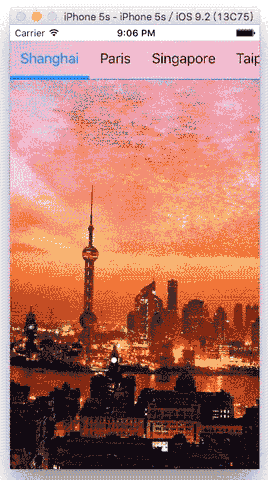

JZScrollTitleView
==========
JZScrollTitleView是使用Swift编写的一个标题组组件，继承自`UIControl`。标题长度无限制，可以左右来回滑动。对当前选中标题自动定位在屏幕的中间，可设置的颜色高亮和有游标更随。

demo:
 


Requirements
----------
- iOS 7.0+
- Xcode 7.0+
- Swift 2.1

Usage
----------
直接将`JZScrollTitleView.swift`拖入到工程中。

```swift
	var scrollTitleView = JZScrollTitleView()
//		scrollTitleView.frame
	scrollTitleView.titles = ["Shanghai", "Paris", "Singapore", "Taipei", "Willemstad"]
	view.addSubview(scrollTitleView)

```
调用`addTarget:`监听scrollTitleView的事件，注意：只对`ValueChanged`事件有效

```swift
	scrollTitleView.addTarget(object, action: "tapTitle:", forControlEvents: .ValueChanged)
```

License
----------
适用于MIT协议